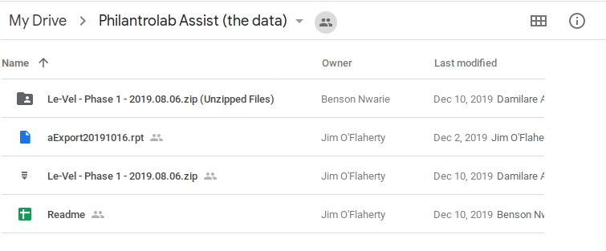
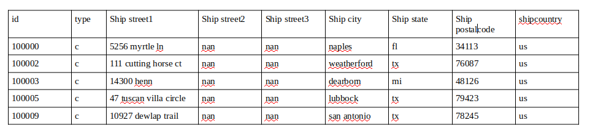
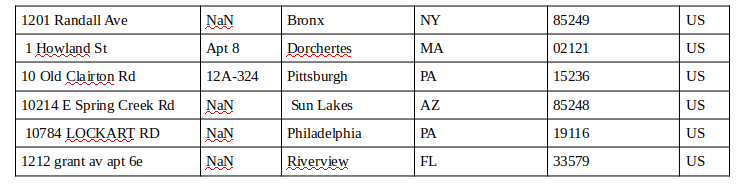

# Fraud Detection Machine Learning Model

## Problem Statement
        There is no clear problem statement and also what you want the solution to solve for ?

## Folder structure
Below is a screenshot of the folder structure from google drive that contains .rpt (Crystal report file format), Readme in excel format and a zip file containing some .tab files.

The Readme.xls contains descriptions fieled for each file, which is not clear description for each file.

        Can we get a detailed explanation of what each file is supposed to do ?

## Data Wrangling
After loading the data into pandas for data wrangling and exploaration, Below are summary details of the `aExport20191016.rpt` and the `aBlacklist20190805.tab` datasets.

`aExport20191016.rpt`

`aBlacklist20190805.tab`

        Can we get a detailed explanation of each column in all the database as this will enable us to understand the dataset effectively while doind data exploration and analysis and also building the machine learning model.

## Technologies & Packages
1. Python3
2. Pandas
